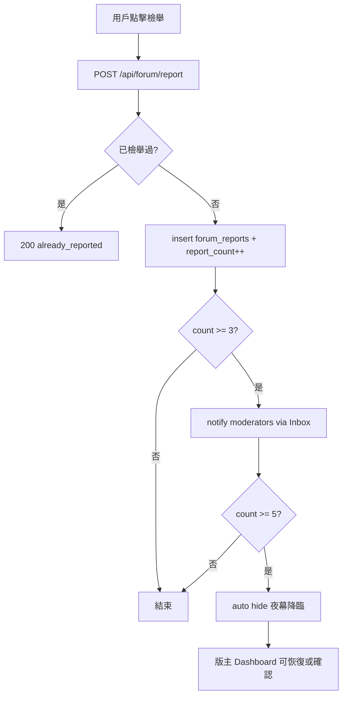

# 月光圍爐版主系統與社群治理升級方案

> **狀態：** 設計文件（尚未實作）  
> **範圍：** 版主權限分級（RBAC）、檢舉治理、版主 Dashboard、**匿名發文（Ghost Mode）**、**沉浸式閱讀**、**留言互動（@提及／樓中樓）**  
> **相關現況：** [SYSTEM-OVERVIEW.md](./SYSTEM-OVERVIEW.md) §5.1、`src/pages/api/forum/*`、`profiles` / `forum_posts`

---

## 1. 目標與原則

### 1.1 產品目標

為「月光圍爐」論壇建立可持續的社群治理能力，讓核心團隊與受信任的版主能：

- 快速處理惡意造謠、直男闖入、引戰言論（**夜幕降臨**＝隱藏處理）
- 置頂官方公告、每週話題與優質長文
- 以 **月光加冕** 標記精華文章，並同步至論壇首頁精選區
- 協助整理標籤分類（如 `#情感樹洞`、`#貓咪日常`）
- 透過匿名檢舉與 Inbox 通知，在社群自發與人工審核之間取得平衡
- 提供 **Ghost Mode（匿名黑貓）** 發文，讓極私密求助／出櫃經歷有安全感
- 以 **沉浸式閱讀**、**只看樓主** 優化長文與連載體驗
- 強化留言區 **@提及** 與 **樓中樓回覆**，讓討論線索清晰

### 1.2 設計原則

| 原則 | 說明 |
|---|---|
| **權限在伺服器** | 所有版主操作必須經 API + service role 驗證 `forum_role`；前端僅控制 UI 顯示 |
| **沿用現有身份模型** | 帳號身份在 `profiles`（非獨立 `users` 表）；`profiles.id` = `auth.users.id` |
| **漸進式升級** | 先 DB + API + Dashboard，再前台視覺與 Inbox 通知；不破壞現有發文／留言流程 |
| **審計可追溯** | 版主操作寫入 `forum_moderation_log`，便於事後覆核 |
| **發文不可逆** | 主帖與留言發布後**皆不可**自行編輯或刪除；修正只能透過新留言補充，或聯絡版主／檢舉流程處理 |
| **匿名與治理並存** | Ghost 帖對讀者去識別化，但**版主／Admin 仍可追溯** `author_id` 以處理濫用（不對外公開） |
| **軟刪為預設** | 版主治理以 **夜幕降臨**（hidden）為預設；**硬刪除**僅 Admin、且需二次確認 |

### 1.3 已決策摘要（產品確認）

| 議題 | 決策 |
|---|---|
| 檢舉門檻 | **3 次** → 通知版主 Inbox；**5 次** → 自動夜幕降臨（維持拆分） |
| 版主對外身份 | `moderator` 與 `admin` **統一**對外顯示 🛡️「**月光守護者**」（不另用 👑） |
| 刪除策略 | **軟刪（hidden）為預設**；僅 **Admin** 可硬刪除 |
| Dashboard 存取 | **僅站方**：`DASHBOARD_SECRET`／`x-dashboard-key` + 建議 VPN；**不**開放版主自行登入 `/dashboard/forum` |
| 月光精選 | 精選區／`featured_posts` **僅 `visibility = public`**；`members_only` **不可**出現在公開精選預覽 |
| 留言可改性 | 留言**比照主帖**：發後不可編輯／刪除（§3.3） |
| 沉浸式閱讀 | **無字數門檻**；任何貼文皆可「關燈看文」，並可 **scroll 睇哂** 全文 |
| 樓中樓深度 | **鎖定 1 層**（僅回覆頂層留言，不可回覆子留言） |

---

## 2. 現況盤點（As-Is）

以下為撰寫本文件時的程式庫狀態，實作時應重新核對。

### 2.1 資料層

| 項目 | 現況 |
|---|---|
| 用戶表 | `profiles`（`display_name`、`status`、`subscription_tier` 等）；**尚無** `forum_role` |
| 主帖 | `forum_posts`：`visibility` ∈ `public` / `members_only` / `hidden`；`report_count` |
| 留言 | `forum_comments`：`is_hidden`、`report_count` |
| 標籤 | `forum_post_tags` + `forum-tags.js` / `forum-categories.js` |
| 檢舉 | `POST /api/forum/report` 寫入 `forum_reports`；累計 `report_count` |
| 自動隱藏門檻 | `src/lib/moderation.js`：`REPORT_AUTO_HIDE_THRESHOLD = 5`（≥5 自動隱藏） |
| 置頂／精華 | **尚未有** `is_pinned`、`is_highlighted` 等欄位 |
| 匿名發文（Ghost） | **尚未有** `is_ghost_post`；現僅 `anonymous_name_snapshot` 存發文時暱稱 |
| 版主操作紀錄 | **尚未有** |

> **注意：** 檢舉門檻已確認為 **≥3 通知版主**、**≥5 自動隱藏**（見 §1.3、§5.2）。**主帖與留言皆不可自行編輯／刪除**（見 §3.3）。

### 2.2 API 與前台

| 能力 | 路徑／元件 |
|---|---|
| 列表／發文 | `GET/POST /api/forum/posts` |
| 詳情／愛心 | `GET /api/forum/posts/[id]` |
| 留言 | `/api/forum/posts/[id]/comments` |
| 檢舉 | `POST /api/forum/report`（貼文詳情頁已有 ⚑ 按鈕） |
| 編輯／刪除自己的帖／留言 | **文件層未實作**；若存在舊版 `PATCH`／`DELETE` 作者端點，升級時應**關閉**（見 §3.3） |
| 側欄熱門 | `GET /api/forum/meta`（`hot_posts` 依本週互動分排序，非精華庫） |
| 作者顯示 | `ForumAuthorName.js`（Premium 🌙）；**尚無版主 icon** |
| @提及 | `forum-mentions.js`、`ForumTiptapEditor`（**發文**）；留言欄 `ForumCommentField` **尚未**完整支援 |
| 樓中樓 | DB 有 `forum_comments.parent_comment_id`；API 可寫入；**前台扁平列表，無 Reply UI** |
| 只看樓主 | `[postId].js` 已有 `opOnly` 篩選按鈕（**部分實作**） |
| 沉浸式閱讀 | **尚未實作** |
| 後台認證 | `src/lib/dashboard-auth.js`（`DASHBOARD_SECRET` + `x-dashboard-key`） |

### 2.3 缺口摘要

1. 無角色欄位與權限檢查 helper  
2. 無版主專用 API（隱藏、置頂、加冕、改標籤）  
3. 無版主 Dashboard UI  
4. 檢舉達門檻僅自動隱藏，**未通知版主 Inbox**  
5. 論壇首頁無「精選／加冕」專區（僅算法熱門）  
6. 需明確落實 **會員不可編輯／刪除自己的主帖與留言**（§3.3）  
7. **Ghost Mode** 匿名發文與公開 API 去識別化  
8. 長文 **沉浸式閱讀**、留言 **樓中樓 UI** 與留言區 **@提及**

---

## 3. 角色分級（RBAC）

### 3.1 欄位設計

在 **`profiles`** 表新增（不另建 `users` 表）：

```sql
ALTER TABLE public.profiles
  ADD COLUMN IF NOT EXISTS forum_role text NOT NULL DEFAULT 'member'
  CHECK (forum_role IN ('member', 'moderator', 'admin'));

CREATE INDEX IF NOT EXISTS profiles_forum_role_idx
  ON public.profiles (forum_role)
  WHERE forum_role <> 'member';
```

| 值 | 對外稱呼 | 說明 |
|---|---|---|
| `member` | （一般會員） | 預設；無管理權限 |
| `moderator` | **月光守護者**／版主 | 內容治理：隱藏、置頂、加冕、改標籤 |
| `admin` | **管理員**（對外亦稱 **月光守護者** 🛡️） | 含版主全部權限 + 指派／撤銷版主、**硬刪**、檢視完整審計；站內權限高於版主，**前台不另顯示 👑** |

**指派方式：**

- **Dashboard（站方）：** `/dashboard/forum/team` — 搜尋用戶、指派 `member` / `moderator` / `admin`（`PATCH /api/dashboard/forum-moderators`）
- **備用：** Supabase SQL 直接更新 `profiles.forum_role`

**與 `profiles.status` 的關係：**

- `status = suspended` 仍為全站封禁，優先於 `forum_role`
- 版主帳號若被 `limited`，僅能讀取 Dashboard，不可執行治理動作

### 3.2 權限矩陣

| 操作 | member | moderator | admin |
|---|:---:|:---:|:---:|
| 發文／留言／檢舉 | ✓ | ✓ | ✓ |
| **編輯自己的主帖** | — | — | — |
| **刪除自己的主帖** | — | — | — |
| **編輯自己的留言** | — | — | — |
| **刪除自己的留言** | — | — | — |
| **夜幕降臨**（`visibility → hidden` / 留言 `is_hidden`） | — | ✓ | ✓ |
| **恢復顯示**（undo hide） | — | ✓ | ✓ |
| **置頂**（Pin） | — | ✓ | ✓ |
| **月光加冕**（Highlight） | — | ✓ | ✓ |
| **修改他人標籤** | — | ✓ | ✓ |
| **硬刪除**貼文／留言 | — | — | ✓† |
| 指派／撤銷版主 | — | — | ✓ |
| 檢視檢舉者身份（`forum_reports`） | — | — | ✓* |

\* 版主預設僅見檢舉次數與內容摘要，不見檢舉者 ID，以維持匿名檢舉；Admin 可見完整審計。  
† 硬刪除為例外手段；**預設治理一律用夜幕降臨（軟刪）**，硬刪需 Admin 二次確認並寫入審計 log。

**說明：**

- **主帖（`forum_posts`）** 與 **留言（`forum_comments`）** 一經發布，作者（含 `member`／`moderator`／`admin` 以個人身份發文）**皆不可**在前台或一般 API 編輯、刪除。
- 作者若需更正，應再發留言補充，或透過檢舉／聯絡版主；版主以 **夜幕降臨**（軟刪）處理不當內容，**Admin** 在必要時才 **硬刪除**。

### 3.3 發文／留言不可逆 — API 與前台約束

| 層級 | 要求 |
|---|---|
| **前台** | 貼文詳情／列表、留言列**不顯示**「編輯」「刪除」按鈕（即使 `is_mine === true`） |
| **API（主帖）** | `PATCH`／`DELETE /api/forum/posts/[id]` 對**作者本人**一律 `403`，錯誤碼 `author_cannot_modify_post` |
| **API（留言）** | `PATCH`／`DELETE` 留言端點（若存在）對**作者本人**一律 `403`，錯誤碼 `author_cannot_modify_comment` |
| **版主 API** | 僅 `/api/forum/moderation/*` 可變更治理狀態（hide／pin／highlight／tags）；**不提供**代作者改正文 |
| **RLS** | 撤銷或收緊 `Authors can update own posts`／留言類似 policy |
| **文案** | 發文／留言送出前提示：「內容發出後無法修改或刪除，請三思後再發布。」 |

**刪除層級（已決策）：**

| 動作 | 誰可執行 | 效果 | 預設？ |
|---|---|---|:---:|
| 作者刪除自己的帖／留言 | **無人**（政策禁止） | — | — |
| 夜幕降臨（軟刪） | moderator / admin | 前台不可見，資料保留 | **✓** |
| 硬刪除 | admin only | 自 DB 移除；需二次確認 + 審計 log | 例外 |

### 3.4 伺服器 Helper（建議新增）

```
src/lib/forum-roles.js
  - FORUM_ROLES = ['member','moderator','admin']
  - getForumRole(profile)
  - canModerateForum(role)      // moderator | admin
  - canAdminForum(role)         // admin only
  - requireForumModerator(req)  // throws / 403
```

所有版主 API 在 `requireUser` 之後讀取 `profiles.forum_role`（**勿信任 JWT custom claims**，避免客戶端偽造）。

---

## 4. 資料庫擴充

### 4.1 `forum_posts` 治理欄位

```sql
ALTER TABLE public.forum_posts
  ADD COLUMN IF NOT EXISTS is_pinned boolean NOT NULL DEFAULT false,
  ADD COLUMN IF NOT EXISTS pinned_at timestamptz,
  ADD COLUMN IF NOT EXISTS pinned_by uuid REFERENCES public.profiles(id),
  ADD COLUMN IF NOT EXISTS is_highlighted boolean NOT NULL DEFAULT false,
  ADD COLUMN IF NOT EXISTS highlighted_at timestamptz,
  ADD COLUMN IF NOT EXISTS highlighted_by uuid REFERENCES public.profiles(id),
  ADD COLUMN IF NOT EXISTS moderation_note text;  -- 內部備註，不對外顯示

CREATE INDEX IF NOT EXISTS forum_posts_pinned_idx
  ON public.forum_posts (is_pinned DESC, pinned_at DESC NULLS LAST)
  WHERE visibility <> 'hidden';

CREATE INDEX IF NOT EXISTS forum_posts_highlighted_idx
  ON public.forum_posts (is_highlighted DESC, highlighted_at DESC NULLS LAST)
  WHERE visibility <> 'hidden' AND is_highlighted = true;
```

**語意對照：**

| 產品用語 | DB / API |
|---|---|
| 夜幕降臨 | `visibility = 'hidden'`（帖）；`is_hidden = true`（留言） |
| 置頂 | `is_pinned = true`，列表 API 置頂區優先排序 |
| 月光加冕 | `is_highlighted = true`，出現在首頁精選 + 卡片標籤 |

### 4.2 `forum_reports`（檢舉表）

若生產環境尚未建表，建議 migration：

```sql
CREATE TABLE IF NOT EXISTS public.forum_reports (
  id           uuid PRIMARY KEY DEFAULT gen_random_uuid(),
  reporter_id  uuid NOT NULL REFERENCES public.profiles(id) ON DELETE CASCADE,
  target_type  text NOT NULL CHECK (target_type IN ('post', 'comment')),
  target_id    uuid NOT NULL,
  reason       text,  -- Phase 2：可選原因（謠言／引戰／騷擾…）
  created_at   timestamptz NOT NULL DEFAULT now(),
  UNIQUE (reporter_id, target_type, target_id)
);

CREATE INDEX IF NOT EXISTS forum_reports_target_idx
  ON public.forum_reports (target_type, target_id);
```

- **匿名性：** 前台不顯示檢舉者；版主 Dashboard 預設只顯示累計次數
- 現有 API 已做 `UNIQUE (reporter_id, target_type, target_id)` 防重複檢舉

### 4.3 `forum_moderation_log`（審計）

```sql
CREATE TABLE IF NOT EXISTS public.forum_moderation_log (
  id            uuid PRIMARY KEY DEFAULT gen_random_uuid(),
  actor_id      uuid NOT NULL REFERENCES public.profiles(id),
  action        text NOT NULL,  -- hide_post | unhide_post | pin | unpin | highlight | unhighlight | edit_tags | delete_post | ...
  target_type   text NOT NULL,
  target_id     uuid NOT NULL,
  payload       jsonb,          -- 變更前後快照、標籤 diff
  created_at    timestamptz NOT NULL DEFAULT now()
);

CREATE INDEX IF NOT EXISTS forum_moderation_log_created_idx
  ON public.forum_moderation_log (created_at DESC);
```

### 4.4 Inbox 通知（檢舉達門檻）

新增 `inbox_messages.message_type` 值（或沿用 `payload` 區分）：

| 建議 type | 用途 |
|---|---|
| `forum_moderation_alert` | 某帖／留言檢舉達通知門檻，待版主處理 |

`payload` 建議結構：

```json
{
  "kind": "report_threshold",
  "target_type": "post",
  "target_id": "uuid",
  "report_count": 3,
  "post_title": "…",
  "preview": "內容摘要…",
  "forum_url": "/forum/{id}"
}
```

**收件人：** 所有 `forum_role IN ('moderator','admin')` 且 `status = 'active'` 的 `profiles.id`。

**去重：** 同一 `target_id` 在 24 小時內只發一次 alert（避免洗版）。

---

## 5. 檢舉與自動治理流程

### 5.1 前台（已有基礎）

- 貼文詳情 `src/pages/forum/[postId].js`：帖與留言均有 ⚑ 檢舉
- 列表頁（可選 Phase 2）：卡片更多選單加入檢舉

檢舉確認文案建議維持中性：「此檢舉為匿名，我們會交由月光守護者處理。」

### 5.2 檢舉門檻（已確認）

| 事件 | 門檻 | 行為 |
|---|---|---|
| **通知版主** | `report_count >= 3` | 寫入 Inbox `forum_moderation_alert`（見 §4.4） |
| **自動夜幕降臨** | `report_count >= 5` | `visibility → hidden`（帖）／`is_hidden = true`（留言） |

常數集中於 `src/lib/moderation.js`：

```js
export const REPORT_MODERATOR_NOTIFY_THRESHOLD = 3;
export const REPORT_AUTO_HIDE_THRESHOLD = 5;
```

### 5.3 處理流程（Mermaid）



### 5.4 `POST /api/forum/report` 擴充要點

在現有 `src/pages/api/forum/report.js` 基礎上：

1. `report_count` 更新後，若 `>= REPORT_MODERATOR_NOTIFY_THRESHOLD` 且未發過 alert → 呼叫 `notifyForumModerators()`
2. 自動隱藏邏輯與通知邏輯**解耦**（3 次通知、5 次隱藏可並存）
3. 回傳 JSON 可增加 `moderator_notified: boolean`（不含收件人資訊）

---

## 6. 版主 API 設計

建議新增命名空間：`/api/forum/moderation/*`（均需 `requireForumModerator`）。

| 方法 | 路徑 | 說明 |
|---|---|---|
| `GET` | `/api/forum/moderation/queue` | 待處理：高檢舉帖、hidden 待覆核、最新檢舉 |
| `POST` | `/api/forum/moderation/posts/[id]/hide` | **預設治理**：夜幕降臨（軟刪）；body: `{ note? }` |
| `POST` | `/api/forum/moderation/posts/[id]/unhide` | 恢復顯示 |
| `POST` | `/api/forum/moderation/posts/[id]/pin` | 置頂；body: `{ pinned: true/false }` |
| `POST` | `/api/forum/moderation/posts/[id]/highlight` | 月光加冕；body: `{ highlighted: true/false }` |
| `PATCH` | `/api/forum/moderation/posts/[id]/tags` | 覆寫標籤；body: `{ tags: string[] }` |
| `DELETE` | `/api/forum/moderation/posts/[id]` | **Admin only** 硬刪 |
| `POST` | `/api/forum/moderation/comments/[id]/hide` | 隱藏留言 |
| `GET` | `/api/forum/moderation/log` | 審計日誌（分頁） |

**列表 API 調整**（`GET /api/forum/posts`）：

1. 回傳欄位增加：`is_pinned`, `is_highlighted`（公開可見）
2. 排序：`is_pinned DESC, pinned_at DESC` → 再依現有 `latest` / `popular`
3. 過濾：`visibility = hidden` 的帖對一般用戶不可見；版主 API 可帶 `?include_hidden=1`

**精選 API**（擇一）：

- `GET /api/forum/featured` → `is_highlighted = true` 的帖（首頁精選區）
- 或擴充 `GET /api/forum/meta` 增加 `featured_posts` 陣列

---

## 7. 前端視覺與氛圍

### 7.1 版主身份展示

| 位置 | 設計 |
|---|---|
| Display Name 旁 | **`moderator` 與 `admin` 皆用** Icon **🛡️**；對外稱呼統一 **「月光守護者」**（不顯示 👑） |
| 論壇發言頭卡 | 作者列增加 `forum-author--moderator` class：淡紫色外光暈（`box-shadow` + 低透明度 gradient border） |
| 工具提示 | `title="月光守護者"`（admin 對外亦不標「管理員」於暱稱旁，權限差異僅在後台／工具列） |

**實作切入：**

- `ForumAuthorName.js`：新增 prop `forumRole`；`moderator` **或** `admin` 時渲染 `<span class="forum-role-badge" aria-label="月光守護者">🛡️</span>`
- 列表／詳情 API 在 `author` 物件帶 `forum_role`（僅 `moderator`/`admin` 對外暴露；**對外 label 皆為月光守護者**）
- CSS：`src/styles/forum.css` 或現有 forum 樣式檔

```css
/* 示意 */
.forum-author-name--moderator {
  box-shadow: 0 0 12px rgba(189, 147, 249, 0.35);
  border-radius: 4px;
  padding: 0 4px;
}
```

### 7.2 貼文狀態標籤（世界觀文案）

| 狀態 | 列表／詳情角標 |
|---|---|
| 置頂 | `📌 圍爐置頂` |
| 月光加冕 | `✨ 月光加冕` |
| 會員限定 | 沿用現有 `🔒 會員限定` |
| 已隱藏（僅版主可見） | `🌑 夜幕降臨` |

置頂帖視覺：卡片頂部細光帶（參考 `ForumCampfireGlow` 紫色系，降低動畫幅度以免搶眼）。

### 7.3 版主操作 UI（前台輕量）

在貼文詳情頁，若 `session` 對應 `forum_role` 為 moderator/admin，顯示 **「守護者工具列」**（預設收合）：

- 夜幕降臨／恢復月光
- 置頂／取消置頂
- 加冕／取消加冕
- 編輯標籤（複用 `ForumTagField` 唯讀模式 + 儲存）

一般用戶不可見此工具列。

### 7.4 檢舉按鈕

- 維持現有 ⚑；列表頁可補上
- 無需顯示檢舉次數（避免引戰）
- 登入才可檢舉（現況已符合）

---

## 8. 版主 Dashboard

### 8.1 定位

**存取政策（已決策）：**

- Dashboard（含 `/dashboard/forum`）**僅站方**使用：`DASHBOARD_SECRET` + `x-dashboard-key`，並建議經 **VPN／IP 限制**。
- **不**開放一般版主以帳號登入 Dashboard；版主日常治理走**前台「守護者工具列」**（§7.3）。
- 頁內敏感操作（硬刪、指派角色）仍須登入帳號且 `forum_role = admin`，並記錄 `actor_id`。

建議路徑：

| 頁面 | 路徑 | 說明 |
|---|---|---|
| 治理總覽 | `/dashboard/forum` | KPI、待處理佇列入口 |
| 檢舉佇列 | `/dashboard/forum/reports` | 依 `report_count` 排序的帖／留言 |
| 內容管理 | `/dashboard/forum/posts` | 搜尋、篩選、批量置頂／加冕／隱藏 |
| 精選管理 | `/dashboard/forum/featured` | 月光加冕文章排序（拖曳 Phase 2） |
| 審計日誌 | `/dashboard/forum/log` | `forum_moderation_log` |
| 團隊（Admin） | `/dashboard/forum/team` | 指派 `forum_role`（站方 Dashboard）✅ |

~~認證雙層~~（已廢止對外版主 Dashboard 方案）：僅保留站方 `x-dashboard-key` 進入；前台版主用 Bearer + `forum_role` 操作工具列。

### 8.2 總覽 KPI（建議）

- 今日新帖／留言數
- 待處理檢舉數（`report_count >= 3` 且未 hidden）
- 本週夜幕降臨次數
- 目前置頂／加冕數量

### 8.3 檢舉佇列 UX

每列顯示：

- 標題／摘要、topic、標籤
- 檢舉次數、最後檢舉時間
- 快速動作：開啟帖、夜幕降臨、加冕、忽略（標記已處理，可寫入 log 不改內容）

**Inbox 連動：** `/inbox` 收到 `forum_moderation_alert` 時，CTA 連至 `/dashboard/forum/reports?target={id}` 或 `/forum/{id}?mod=1`。

### 8.4 Dashboard API（站方）

可復用 `/api/forum/moderation/*`，或另設 `/api/dashboard/forum/*` 包一層 `checkDashboardAuth` + 指定 `actor_id` 參數。建議 **單一實作** 在 moderation 模組，Dashboard 與前台版主工具列共用。

---

## 9. 論壇首頁精選區（月光加冕）

### 9.1 版面

在 `/forum` 列表上方（topic 篩選列之下）新增 **「✨ 月光精選」** 橫向卡片區：

- 資料來源：`is_highlighted = true` **且** `visibility = 'public'`（**不含** `members_only`）
- 預設顯示 3–5 篇，可橫向捲動
- 與 `hot_posts`（本週熱門）分開；熱門仍由算法決定，精選由版主策展
- `members_only` 帖可被加冕供會員在站內瀏覽，但**不得**出現在首頁公開精選預覽卡片

### 9.2 與 `GET /api/forum/meta` 的關係

擴充回傳：

```json
{
  "featured_posts": [
    { "id", "title", "topic", "tags", "anonymous_name_snapshot", "highlighted_at" }
  ],
  "hot_posts": [ ... ]
}
```

---

## 10. 匿名發文切換器（Ghost Mode）

### 10.1 產品目標

論壇為**登入後可見**，但許多使用者想發佈極私密內容（情感求助、出櫃經歷等）。發文介面提供 **「以匿名黑貓身份發佈」** Toggle；開啟後，讀者僅見 **匿名黑貓**，後端對外公開資料去識別化，同時保留版主治理所需的最小追溯能力。

### 10.2 前台 UX

| 元素 | 說明 |
|---|---|
| 位置 | `ForumComposeField`／發文 Overlay 標題列下方或可見度選項旁 |
| 控件 | Toggle + 說明：「以匿名黑貓身份發佈 — 讀者看不到你的暱稱與 Mirror Card」 |
| 預設 | **關閉**（以 `profiles.display_name` 發文） |
| 確認 | 首次開啟可顯示輕量說明：「匿名帖仍受社群守則約束；惡意造謠可被版主處理。」 |
| 列表／詳情 | 作者列顯示 **匿名黑貓** + 可選 🐈‍⬛ icon；**不顯示** Premium 🌙、Mirror Card 連結 |
| 本人視角 | `is_mine === true` 時顯示小字：「你以匿名黑貓身份發佈」（僅本人可見） |

### 10.3 資料模型

```sql
ALTER TABLE public.forum_posts
  ADD COLUMN IF NOT EXISTS is_ghost_post boolean NOT NULL DEFAULT false;
```

**寫入規則（`POST /api/forum/posts`）：**

| 欄位 | `is_ghost_post = false` | `is_ghost_post = true` |
|---|---|---|
| `author_id` | 真實 `profiles.id` | **仍寫真實 ID**（伺服器內部；不對外公開） |
| `anonymous_name_snapshot` | `display_name` | 固定 **`匿名黑貓`** |
| `is_ghost_post` | `false` | `true` |

> **為何不將 `author_id` 設為 NULL？**  
> 需支援：只看樓主、月光旅程、檢舉、版主追溯、重複發文濫用偵測。  
> **不建議**對 `author_id` 做可逆加密後仍當 FK；改以 **API 層與 RLS 對讀者隱藏** 即可。

**公開 API 回傳（列表／詳情）：**

```json
{
  "author": {
    "display_name": "匿名黑貓",
    "mirror_slug": null,
    "mirror_type": null,
    "is_premium": false,
    "is_ghost": true
  },
  "is_mine": false
}
```

- 永不回傳 `author_id`（現況已 `author_id: undefined`）
- `is_mine` 僅在**當前登入者為作者**時為 `true`，但不洩漏真實暱稱給其他讀者

**版主／Admin Dashboard：**

- 檢舉佇列、內容管理可見真實 `author_id`／`display_name`（需 `forum_role` ≥ moderator）
- 寫入 `forum_moderation_log` 時記錄真實操作者與被治理帖之真實作者

### 10.4 安全與濫用防護

| 風險 | 緩解 |
|---|---|
| 匿名造謠／引戰 | 檢舉流程 + 版主夜幕降臨；Ghost **不豁免**治理 |
| 一人多號洗版 | 維持 `forum_post_daily` 配額；Ghost 帖**計入**同一配額 |
| 冒充他人 | 公開顯示統一為「匿名黑貓」，不提供自訂匿名暱稱（Phase 1） |
| 作者自稱匿名卻被猜中 | 不顯示 Mirror 家族徽章、不連結 `/mirror-card` |

**Rate limit：** Ghost 帖與一般帖相同；可選 Phase 2 對「每帳號每日 Ghost 帖上限」另設較低值（如 2／日）。

### 10.5 API 擴充

`POST /api/forum/posts` body 新增：

```json
{
  "content": "…",
  "is_ghost_post": true
}
```

- 伺服器強制：`is_ghost_post === true` → `anonymous_name_snapshot = '匿名黑貓'`
- 客戶端**不可**自訂匿名顯示名

---

## 11. 沉浸式閱讀體驗（Enhance for Reading）

讓讀者像讀小說一樣享受長文，尤其連載、情感長帖。

### 11.1 沉浸式閱讀模式（Immersive Reading Mode）

| 項目 | 規格 |
|---|---|
| 觸發條件 | **無字數門檻** — 所有貼文詳情頁皆可使用 |
| 入口 | 貼文詳情卡片右上角 **「關燈看文 🌙」** 按鈕（長文可更醒目，但短帖亦保留） |
| 行為 | 點擊後進入 Reader 模式；再點或按 `Esc` 退出 |
| 捲動 | **保留全文捲動**：主文區 `overflow-y: auto`／沿用頁面 scroll，讀者可 **scroll down 睇哂** 整篇正文；不因進入模式而截斷或摺疊內容 |
| 視覺 | 側欄、論壇 header、頁尾、留言區 **淡出為深黑**（`opacity` + `pointer-events: none`）；主文區置中、最大寬度約 `42rem` |
| 排版 | 字級 +1 級（如 `16px → 18px`）、`line-height: 1.8`、段落間距略增 |
| 無障礙 | `aria-pressed`、焦點留在主文；退出後焦點回到按鈕 |
| 狀態 | 可選 `sessionStorage` 記住「此帖曾開啟過」；**不**預設每次進入都開啟 |

**實作切入：**

- `src/pages/forum/[postId].js`：`immersiveOpen` state + `useEffect` 監聽 `Escape`
- `document.documentElement.classList.toggle('forum-immersive-reading', immersiveOpen)`
- CSS：`src/styles/pixel-theme.css` 或獨立 `forum-reading.css`

```css
/* 示意 */
html.forum-immersive-reading .app-header--forum,
html.forum-immersive-reading .forum-sidebar,
html.forum-immersive-reading #forum-comments {
  opacity: 0;
  pointer-events: none;
  transition: opacity 0.35s ease;
}
html.forum-immersive-reading .forum-post-card__body {
  font-size: 1.125rem;
  line-height: 1.8;
}
html.forum-immersive-reading .forum-post-card__body-wrap {
  max-height: none;
  overflow: visible;
}
```

**實作注意：** 勿用 `max-height`／`overflow: hidden` 截斷正文；Reader 模式只藏 chrome，不限制內文長度。

### 11.2 「只看樓主」（Author Only）

長文連載時，樓主常在**留言區**續寫；讀者需一口氣讀完故事線。

| 項目 | 規格 |
|---|---|
| 現況 | `[postId].js` 已有 **「只看樓主」** 按鈕與 `opOnly` 篩選（`is_op`／`author_id === post.author_id`） |
| 升級 | ① 標籤含 `#連載` 或留言數多時顯示提示：「樓主可能在留言續寫，可點只看樓主」② 篩選時保留**時間序** ③ Ghost 帖樓主留言仍顯示為「匿名黑貓」 |
| API | `GET` 詳情可支援 `?op_only=1` 僅回傳樓主留言（減少 payload，Phase 2） |
| 與 Ghost | 樓主以 Ghost 發帖時，`is_op` 比對仍用伺服器 `author_id`，讀者看不到真名 |

---

## 12. 留言互動優化

### 12.1 @提及（Mentions）

**現況：** 發文編輯器 `ForumTiptapEditor` 已整合 `forum-mentions.js`、`forum-mention-notify.js`（Inbox／Email 通知）。

**升級目標：**

| 能力 | 說明 |
|---|---|
| 留言區 @ | `ForumCommentField` 支援輸入 `@` 彈出用戶搜尋（複用 `GET /api/forum/users/search`） |
| 渲染 | `ForumMarkdownBody` 將 `@display_name` 轉為 `forum-mention-link`（可點擊至 Mirror Card） |
| Ghost 帖 | 留言中 @ 他人仍顯示被提及者真實暱稱；**不可** @ 出 Ghost 作者真身（搜尋結果排除「僅以 Ghost 身份出現的關聯」— Phase 2；Phase 1 允許 @ 一般會員即可） |
| 通知 | 沿用 `dispatchForumMentions`；`notification_prefs` 可增加 `email_on_forum_mention`（若尚未有） |

### 12.2 樓中樓（Threaded Replies）

**現況：** `forum_comments.parent_comment_id` 已存在；`POST …/comments` 可傳 `parent_comment_id`；前台**扁平**列出所有留言。

**升級目標：**

| 項目 | 規格 |
|---|---|
| UI | 每則留言旁 **「回覆」** → 展開 inline 輸入框；子留言縮排顯示（`margin-left` / 左側細線） |
| 深度 | **鎖定 1 層**（僅可回覆**頂層**留言；`parent_comment_id` 指向頂層 id；**禁止**回覆子留言）。API 校驗：若 `parent` 本身已有 `parent_comment_id`，回傳 `400` |
| 排序 | 頂層留言 `created_at ASC`；子留言緊接父留言下方按時間 |
| API `GET` 詳情 | 回傳 `comments` 可改為樹狀 `replies: []` 或扁平 + `parent_comment_id`（前台組樹） |
| 只看樓主 | 啟用時仍只顯示樓主留言，但**保留樓主回覆自己的子樓層結構**（若樓主回覆讀者留言且政策允許顯示—或隱藏非樓主子樹） |
| 檢舉 | 子留言獨立 `target_type: comment` |

**資料無需新表**；可選索引：

```sql
CREATE INDEX IF NOT EXISTS forum_comments_parent_idx
  ON public.forum_comments (parent_comment_id)
  WHERE parent_comment_id IS NOT NULL;
```

---

## 13. 安全與 RLS

### 13.1 RLS 原則

- 一般用戶：**不可** `SELECT` `visibility = hidden` 的帖（維持現有 policy）
- 一般用戶／作者：**不可** `UPDATE` 或 `DELETE` 自己的 `forum_posts` **與** `forum_comments`（落實 §3.3）
- **Ghost 帖：** 公開 API／RLS **不可**向其他讀者暴露 `author_id`；版主 API 以 service role 讀取
- `forum_role`：**不可**由用戶自行 `UPDATE`；僅 service role / admin API
- `forum_reports`：用戶僅能 `INSERT` 自己的檢舉；**不可**讀取他人檢舉

### 13.2 Rate limit

- 檢舉：維持現有 `forum-report` 10 次／小時
- 版主 API：建議 60 次／分鐘／人，防帳號被盜用後大量刪帖
- Ghost 發文：與一般發文共用 `forum_post_daily` 配額

### 13.3 誤隱藏與申訴

- 版主 **恢復顯示** 必須寫入 `forum_moderation_log`
- Phase 2：作者可對 hidden 帖發起 **申訴**（另表 `forum_appeals`），通知 Admin

---

## 14. 實作階段建議

### Phase 1 — 基礎治理（MVP）

- [ ] Migration：`profiles.forum_role`、`forum_posts` 置頂／加冕欄位、`forum_reports`、`forum_moderation_log`
- [ ] `forum-roles.js` + moderation API（hide / pin / highlight / tags）
- [ ] **關閉或拒絕** 會員對自己主帖／留言的 `PATCH`／`DELETE`；前台移除編輯／刪除入口（§3.3）
- [ ] 調整 `moderation.js`：`3` 通知、`5` 自動隱藏；`report.js` 增加 Inbox 通知
- [ ] Dashboard：`/dashboard/forum` + 檢舉佇列（最小可用）
- [x] Dashboard：`/dashboard/forum/team` 版主指派 UI
- [ ] `GET /api/forum/posts` 置頂排序 + `featured_posts`

### Phase 2 — 體驗與視覺

- [ ] `ForumAuthorName` 版主／Admin 統一 🛡️「月光守護者」
- [ ] 貼文角標（置頂／加冕）
- [ ] 詳情頁「守護者工具列」
- [ ] Inbox 訊息模板與未讀樣式
- [ ] 列表頁檢舉入口
- [ ] **Ghost Mode** Toggle + `is_ghost_post` migration（§10）
- [ ] **沉浸式閱讀**「關燈看文 🌙」（§11.1）
- [ ] **只看樓主** UX 強化（連載提示，§11.2）
- [ ] 留言 **@提及**（§12.1）與 **樓中樓 UI**（§12.2）

### Phase 3 — 進階

- [x] Admin 版主指派 UI（`/dashboard/forum/team`）
- [ ] 檢舉原因分類、申訴流程
- [ ] 精選區拖曳排序、`pinned_until` 排程
- [ ] 留言批量治理、關鍵字預警 Dashboard
- [ ] Ghost 每日上限、@ 不洩漏 Ghost 作者搜尋
- [ ] `GET /api/forum/posts/[id]?op_only=1` 伺服器端樓主篩選

---

## 15. 相關檔案（實作時參考）

| 類別 | 路徑 |
|---|---|
| 論壇列表 | `src/pages/forum/index.js` |
| 貼文詳情／檢舉 UI | `src/pages/forum/[postId].js` |
| 檢舉 API | `src/pages/api/forum/report.js` |
| 門檻常數 | `src/lib/moderation.js` |
| 標籤 | `src/lib/forum-tag-stats.js`、`src/lib/forum-tags.js` |
| 作者名稱 | `src/components/ForumAuthorName.js` |
| 側欄 meta | `src/pages/api/forum/meta.js` |
| Inbox | `src/lib/inbox.js` |
| Dashboard 認證 | `src/lib/dashboard-auth.js` |
| 版主指派 | `src/pages/dashboard/forum/team.js`、`src/pages/api/dashboard/forum-moderators.js` |
| 月光圍爐治理 | `src/pages/dashboard/forum/index.js` |
| 帳號 profiles | `docs/IMPLEMENTATION-SQL-MIGRATIONS.md` Migration 001 |
| 論壇帖 schema | 同文件 Migration 010、`supabase/migrations/*forum*` |
| Ghost 發文 | `src/pages/api/forum/posts.js`、`ForumComposeField.js` |
| 沉浸式閱讀／只看樓主 | `src/pages/forum/[postId].js` |
| @提及 | `src/lib/forum-mentions.js`、`ForumTiptapEditor.js`、`ForumCommentField.js` |
| 樓中樓 | `src/pages/api/forum/posts/[id]/comments.js` |

---

## 16. 開放問題（尚未決策）

1. **Ghost 帖**是否限制每日篇數（建議 Phase 2 評估，與一般 `forum_post_daily` 配額分開或共用）？

### 16.1 已決策（原開放問題）

| # | 議題 | 決策 |
|---|---|---|
| 1 | 檢舉門檻 | **3＝通知、5＝自動隱藏** |
| 2 | Admin 對外 icon | **統一 🛡️「月光守護者」** |
| 3 | 硬刪除 | **軟刪（hidden）為預設**；僅 Admin 可硬刪 |
| 4 | Dashboard | **僅站方** VPN／金鑰；版主用前台工具列 |
| 5 | 精選區 | **僅 `public`**；`members_only` 不進公開精選預覽 |
| 6 | 留言可改 | **比照主帖**，發後不可編輯／刪除 |
| 7 | 沉浸式閱讀 | **無字數門檻**；可 scroll 睇哂全文 |
| 8 | 樓中樓深度 | **鎖定 1 層** |

---

## 17. 名詞對照

| 產品文案 | 技術含義 |
|---|---|
| 月光守護者 | `profiles.forum_role` 為 `moderator` **或** `admin`（對外皆 🛡️） |
| 管理員 | `profiles.forum_role = 'admin'`（站內權限；對外仍稱月光守護者） |
| 夜幕降臨 | hide post / comment |
| 月光加冕 | `is_highlighted = true` |
| 圍爐置頂 | `is_pinned = true` |
| 月光精選 | 首頁 `featured_posts` 區塊（**僅 `public`**） |
| 匿名黑貓／Ghost Mode | `is_ghost_post = true`；公開顯示「匿名黑貓」 |
| 發文不可逆 | 主帖與留言發布後不可自行編輯或刪除 |
| 軟刪／硬刪 | 預設夜幕降臨；僅 Admin 硬刪 |
| 關燈看文 | 沉浸式閱讀；無字數門檻、可捲動讀完全文（§11.1） |
| 只看樓主 | Author Only 留言篩選（§11.2） |
| 樓中樓 | `parent_comment_id`；**最大深度 1 層**（§12.2） |

---

*文件版本：2026-07-06 · §1.3 產品決策已確認；§3.3 含留言不可逆；§11.1 沉浸式閱讀無字數門檻。*
