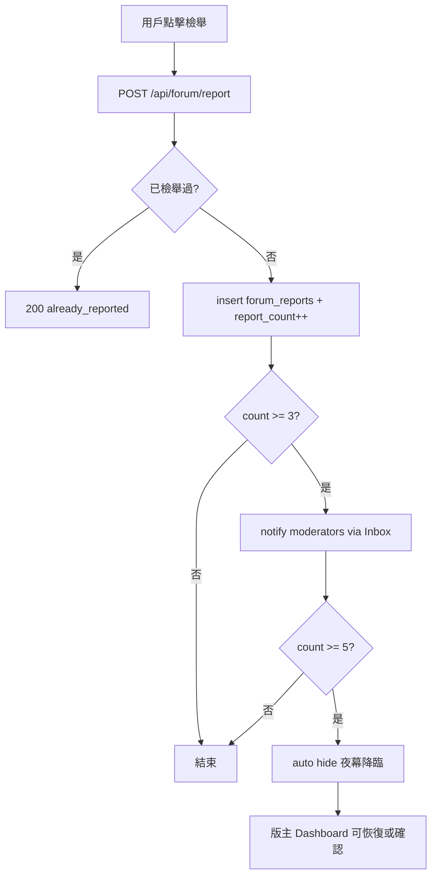

# 月光圍爐版主系統與社群治理升級方案

> **狀態：** 設計文件（尚未實作）  
> **範圍：** 版主權限分級（RBAC）、檢舉治理、前端視覺、版主 Dashboard  
> **相關現況：** [SYSTEM-OVERVIEW.md](./SYSTEM-OVERVIEW.md) §5.1、`src/pages/api/forum/*`、`profiles` / `forum_posts`

---

## 1. 目標與原則

### 1.1 產品目標

為「月光圍爐」論壇建立可持續的社群治理能力，讓核心團隊與受信任的版主能：

- 快速處理惡意造謠、直男闖入、引戰言論（**夜幕降臨**＝隱藏處理）
- 置頂官方公告、每週話題與優質長文
- 以 **月光加冕** 標記精華文章，並同步至論壇首頁精選區
- 協助整理標籤分類（如 `#情感樹洞`、`#貓咪日常`）
- 透過匿名檢舉與 Inbox 通知，在社群自發與人工審核之間取得平衡

### 1.2 設計原則

| 原則 | 說明 |
|---|---|
| **權限在伺服器** | 所有版主操作必須經 API + service role 驗證 `forum_role`；前端僅控制 UI 顯示 |
| **沿用現有身份模型** | 帳號身份在 `profiles`（非獨立 `users` 表）；`profiles.id` = `auth.users.id` |
| **漸進式升級** | 先 DB + API + Dashboard，再前台視覺與 Inbox 通知；不破壞現有發文／留言流程 |
| **審計可追溯** | 版主操作寫入 `forum_moderation_log`，便於事後覆核 |
| **語境一致** | UI 文案採用站內世界觀：夜幕降臨、月光加冕、月光守護者 |

---

## 2. 現況盤點（As-Is）

以下為撰寫本文件時的程式庫狀態，實作時應重新核對。

### 2.1 資料層

| 項目 | 現況 |
|---|---|
| 用戶表 | `profiles`（`display_name`、`status`、`subscription_tier` 等）；**尚無** `forum_role` |
| 主帖 | `forum_posts`：`visibility` ∈ `public` / `members_only` / `hidden`；`report_count` |
| 留言 | `forum_comments`：`is_hidden`、`report_count` |
| 標籤 | `forum_post_tags` + `forum-tags.js` / `forum-categories.js` |
| 檢舉 | `POST /api/forum/report` 寫入 `forum_reports`；累計 `report_count` |
| 自動隱藏門檻 | `src/lib/moderation.js`：`REPORT_AUTO_HIDE_THRESHOLD = 5`（≥5 自動隱藏） |
| 置頂／精華 | **尚未有** `is_pinned`、`is_highlighted` 等欄位 |
| 版主操作紀錄 | **尚未有** |

> **注意：** 產品需求為檢舉 **≥3 次通知版主 Inbox**；現有程式為 **≥5 次自動隱藏**。升級時應拆成兩個門檻（見 §5.3）。

### 2.2 API 與前台

| 能力 | 路徑／元件 |
|---|---|
| 列表／發文 | `GET/POST /api/forum/posts` |
| 詳情／愛心 | `GET /api/forum/posts/[id]` |
| 留言 | `/api/forum/posts/[id]/comments` |
| 檢舉 | `POST /api/forum/report`（貼文詳情頁已有 ⚑ 按鈕） |
| 側欄熱門 | `GET /api/forum/meta`（`hot_posts` 依本週互動分排序，非精華庫） |
| 作者顯示 | `ForumAuthorName.js`（Premium 🌙）；**尚無版主 icon** |
| 後台認證 | `src/lib/dashboard-auth.js`（`DASHBOARD_SECRET` + `x-dashboard-key`） |

### 2.3 缺口摘要

1. 無角色欄位與權限檢查 helper  
2. 無版主專用 API（隱藏、置頂、加冕、改標籤）  
3. 無版主 Dashboard UI  
4. 檢舉達門檻僅自動隱藏，**未通知版主 Inbox**  
5. 論壇首頁無「精選／加冕」專區（僅算法熱門）

---

## 3. 角色分級（RBAC）

### 3.1 欄位設計

在 **`profiles`** 表新增（不另建 `users` 表）：

```sql
ALTER TABLE public.profiles
  ADD COLUMN IF NOT EXISTS forum_role text NOT NULL DEFAULT 'member'
  CHECK (forum_role IN ('member', 'moderator', 'admin'));

CREATE INDEX IF NOT EXISTS profiles_forum_role_idx
  ON public.profiles (forum_role)
  WHERE forum_role <> 'member';
```

| 值 | 對外稱呼 | 說明 |
|---|---|---|
| `member` | （一般會員） | 預設；無管理權限 |
| `moderator` | **月光守護者**／版主 | 內容治理：隱藏、置頂、加冕、改標籤 |
| `admin` | **管理員**／Owner | 含版主全部權限 + 指派／撤銷版主、刪除（硬刪）、檢視完整審計 |

**指派方式（建議）：**

- **Phase 1：** 僅能透過 Supabase SQL 或現有 Dashboard API（`x-dashboard-key`）更新 `profiles.forum_role`
- **Phase 2（可選）：** Admin 專用 `/dashboard/forum/team` 介面管理角色

**與 `profiles.status` 的關係：**

- `status = suspended` 仍為全站封禁，優先於 `forum_role`
- 版主帳號若被 `limited`，僅能讀取 Dashboard，不可執行治理動作

### 3.2 權限矩陣

| 操作 | member | moderator | admin |
|---|:---:|:---:|:---:|
| 發文／留言／檢舉 | ✓ | ✓ | ✓ |
| 編輯／刪除自己的帖 | ✓ | ✓ | ✓ |
| **夜幕降臨**（`visibility → hidden` / 留言 `is_hidden`） | — | ✓ | ✓ |
| **恢復顯示**（undo hide） | — | ✓ | ✓ |
| **置頂**（Pin） | — | ✓ | ✓ |
| **月光加冕**（Highlight） | — | ✓ | ✓ |
| **修改他人標籤** | — | ✓ | ✓ |
| **硬刪除**貼文／留言 | — | — | ✓ |
| 指派／撤銷版主 | — | — | ✓ |
| 檢視檢舉者身份（`forum_reports`） | — | — | ✓* |

\* 版主預設僅見檢舉次數與內容摘要，不見檢舉者 ID，以維持匿名檢舉；Admin 可見完整審計。

### 3.3 伺服器 Helper（建議新增）

```
src/lib/forum-roles.js
  - FORUM_ROLES = ['member','moderator','admin']
  - getForumRole(profile)
  - canModerateForum(role)      // moderator | admin
  - canAdminForum(role)         // admin only
  - requireForumModerator(req)  // throws / 403
```

所有版主 API 在 `requireUser` 之後讀取 `profiles.forum_role`（**勿信任 JWT custom claims**，避免客戶端偽造）。

---

## 4. 資料庫擴充

### 4.1 `forum_posts` 治理欄位

```sql
ALTER TABLE public.forum_posts
  ADD COLUMN IF NOT EXISTS is_pinned boolean NOT NULL DEFAULT false,
  ADD COLUMN IF NOT EXISTS pinned_at timestamptz,
  ADD COLUMN IF NOT EXISTS pinned_by uuid REFERENCES public.profiles(id),
  ADD COLUMN IF NOT EXISTS is_highlighted boolean NOT NULL DEFAULT false,
  ADD COLUMN IF NOT EXISTS highlighted_at timestamptz,
  ADD COLUMN IF NOT EXISTS highlighted_by uuid REFERENCES public.profiles(id),
  ADD COLUMN IF NOT EXISTS moderation_note text;  -- 內部備註，不對外顯示

CREATE INDEX IF NOT EXISTS forum_posts_pinned_idx
  ON public.forum_posts (is_pinned DESC, pinned_at DESC NULLS LAST)
  WHERE visibility <> 'hidden';

CREATE INDEX IF NOT EXISTS forum_posts_highlighted_idx
  ON public.forum_posts (is_highlighted DESC, highlighted_at DESC NULLS LAST)
  WHERE visibility <> 'hidden' AND is_highlighted = true;
```

**語意對照：**

| 產品用語 | DB / API |
|---|---|
| 夜幕降臨 | `visibility = 'hidden'`（帖）；`is_hidden = true`（留言） |
| 置頂 | `is_pinned = true`，列表 API 置頂區優先排序 |
| 月光加冕 | `is_highlighted = true`，出現在首頁精選 + 卡片標籤 |

### 4.2 `forum_reports`（檢舉表）

若生產環境尚未建表，建議 migration：

```sql
CREATE TABLE IF NOT EXISTS public.forum_reports (
  id           uuid PRIMARY KEY DEFAULT gen_random_uuid(),
  reporter_id  uuid NOT NULL REFERENCES public.profiles(id) ON DELETE CASCADE,
  target_type  text NOT NULL CHECK (target_type IN ('post', 'comment')),
  target_id    uuid NOT NULL,
  reason       text,  -- Phase 2：可選原因（謠言／引戰／騷擾…）
  created_at   timestamptz NOT NULL DEFAULT now(),
  UNIQUE (reporter_id, target_type, target_id)
);

CREATE INDEX IF NOT EXISTS forum_reports_target_idx
  ON public.forum_reports (target_type, target_id);
```

- **匿名性：** 前台不顯示檢舉者；版主 Dashboard 預設只顯示累計次數
- 現有 API 已做 `UNIQUE (reporter_id, target_type, target_id)` 防重複檢舉

### 4.3 `forum_moderation_log`（審計）

```sql
CREATE TABLE IF NOT EXISTS public.forum_moderation_log (
  id            uuid PRIMARY KEY DEFAULT gen_random_uuid(),
  actor_id      uuid NOT NULL REFERENCES public.profiles(id),
  action        text NOT NULL,  -- hide_post | unhide_post | pin | unpin | highlight | unhighlight | edit_tags | delete_post | ...
  target_type   text NOT NULL,
  target_id     uuid NOT NULL,
  payload       jsonb,          -- 變更前後快照、標籤 diff
  created_at    timestamptz NOT NULL DEFAULT now()
);

CREATE INDEX IF NOT EXISTS forum_moderation_log_created_idx
  ON public.forum_moderation_log (created_at DESC);
```

### 4.4 Inbox 通知（檢舉達門檻）

新增 `inbox_messages.message_type` 值（或沿用 `payload` 區分）：

| 建議 type | 用途 |
|---|---|
| `forum_moderation_alert` | 某帖／留言檢舉達通知門檻，待版主處理 |

`payload` 建議結構：

```json
{
  "kind": "report_threshold",
  "target_type": "post",
  "target_id": "uuid",
  "report_count": 3,
  "post_title": "…",
  "preview": "內容摘要…",
  "forum_url": "/forum/{id}"
}
```

**收件人：** 所有 `forum_role IN ('moderator','admin')` 且 `status = 'active'` 的 `profiles.id`。

**去重：** 同一 `target_id` 在 24 小時內只發一次 alert（避免洗版）。

---

## 5. 檢舉與自動治理流程

### 5.1 前台（已有基礎）

- 貼文詳情 `src/pages/forum/[postId].js`：帖與留言均有 ⚑ 檢舉
- 列表頁（可選 Phase 2）：卡片更多選單加入檢舉

檢舉確認文案建議維持中性：「此檢舉為匿名，我們會交由月光守護者處理。」

### 5.2 建議門檻（拆分）

| 事件 | 門檻 | 行為 |
|---|---|---|
| **通知版主** | `report_count >= 3` | 寫入 Inbox `forum_moderation_alert`（見 §4.4） |
| **自動夜幕降臨** | 可維持 `>= 5` 或改為 `>= 5` 且未經版主處理 | `visibility → hidden` / 留言 `is_hidden` |

常數建議集中於 `src/lib/moderation.js`：

```js
export const REPORT_MODERATOR_NOTIFY_THRESHOLD = 3;
export const REPORT_AUTO_HIDE_THRESHOLD = 5;  // 可配置
```

### 5.3 處理流程（Mermaid）



### 5.4 `POST /api/forum/report` 擴充要點

在現有 `src/pages/api/forum/report.js` 基礎上：

1. `report_count` 更新後，若 `>= REPORT_MODERATOR_NOTIFY_THRESHOLD` 且未發過 alert → 呼叫 `notifyForumModerators()`
2. 自動隱藏邏輯與通知邏輯**解耦**（3 次通知、5 次隱藏可並存）
3. 回傳 JSON 可增加 `moderator_notified: boolean`（不含收件人資訊）

---

## 6. 版主 API 設計

建議新增命名空間：`/api/forum/moderation/*`（均需 `requireForumModerator`）。

| 方法 | 路徑 | 說明 |
|---|---|---|
| `GET` | `/api/forum/moderation/queue` | 待處理：高檢舉帖、hidden 待覆核、最新檢舉 |
| `POST` | `/api/forum/moderation/posts/[id]/hide` | 夜幕降臨；body: `{ note? }` |
| `POST` | `/api/forum/moderation/posts/[id]/unhide` | 恢復顯示 |
| `POST` | `/api/forum/moderation/posts/[id]/pin` | 置頂；body: `{ pinned: true/false }` |
| `POST` | `/api/forum/moderation/posts/[id]/highlight` | 月光加冕；body: `{ highlighted: true/false }` |
| `PATCH` | `/api/forum/moderation/posts/[id]/tags` | 覆寫標籤；body: `{ tags: string[] }` |
| `DELETE` | `/api/forum/moderation/posts/[id]` | **Admin only** 硬刪 |
| `POST` | `/api/forum/moderation/comments/[id]/hide` | 隱藏留言 |
| `GET` | `/api/forum/moderation/log` | 審計日誌（分頁） |

**列表 API 調整**（`GET /api/forum/posts`）：

1. 回傳欄位增加：`is_pinned`, `is_highlighted`（公開可見）
2. 排序：`is_pinned DESC, pinned_at DESC` → 再依現有 `latest` / `popular`
3. 過濾：`visibility = hidden` 的帖對一般用戶不可見；版主 API 可帶 `?include_hidden=1`

**精選 API**（擇一）：

- `GET /api/forum/featured` → `is_highlighted = true` 的帖（首頁精選區）
- 或擴充 `GET /api/forum/meta` 增加 `featured_posts` 陣列

---

## 7. 前端視覺與氛圍

### 7.1 版主身份展示

| 位置 | 設計 |
|---|---|
| Display Name 旁 | Icon **🛡️**（`moderator`）或 **👑**（`admin`，僅後台／必要處） |
| 論壇發言頭卡 | 作者列增加 `forum-author--moderator` class：淡紫色外光暈（`box-shadow` + 低透明度 gradient border） |
| 工具提示 | `title="月光守護者"` |

**實作切入：**

- `ForumAuthorName.js`：新增 prop `forumRole`；`moderator` 時渲染 `<span class="forum-role-badge" aria-label="月光守護者">🛡️</span>`
- 列表／詳情 API 在 `author` 物件帶 `forum_role`（僅 `moderator`/`admin` 對外暴露，member 不傳）
- CSS：`src/styles/forum.css` 或現有 forum 樣式檔

```css
/* 示意 */
.forum-author-name--moderator {
  box-shadow: 0 0 12px rgba(189, 147, 249, 0.35);
  border-radius: 4px;
  padding: 0 4px;
}
```

### 7.2 貼文狀態標籤（世界觀文案）

| 狀態 | 列表／詳情角標 |
|---|---|
| 置頂 | `📌 圍爐置頂` |
| 月光加冕 | `✨ 月光加冕` |
| 會員限定 | 沿用現有 `🔒 會員限定` |
| 已隱藏（僅版主可見） | `🌑 夜幕降臨` |

置頂帖視覺：卡片頂部細光帶（參考 `ForumCampfireGlow` 紫色系，降低動畫幅度以免搶眼）。

### 7.3 版主操作 UI（前台輕量）

在貼文詳情頁，若 `session` 對應 `forum_role` 為 moderator/admin，顯示 **「守護者工具列」**（預設收合）：

- 夜幕降臨／恢復月光
- 置頂／取消置頂
- 加冕／取消加冕
- 編輯標籤（複用 `ForumTagField` 唯讀模式 + 儲存）

一般用戶不可見此工具列。

### 7.4 檢舉按鈕

- 維持現有 ⚑；列表頁可補上
- 無需顯示檢舉次數（避免引戰）
- 登入才可檢舉（現況已符合）

---

## 8. 版主 Dashboard

### 8.1 定位

在現有 **Dashboard 認證體系**（`DASHBOARD_SECRET`）之上，新增論壇治理專區。建議路徑：

| 頁面 | 路徑 | 說明 |
|---|---|---|
| 治理總覽 | `/dashboard/forum` | KPI、待處理佇列入口 |
| 檢舉佇列 | `/dashboard/forum/reports` | 依 `report_count` 排序的帖／留言 |
| 內容管理 | `/dashboard/forum/posts` | 搜尋、篩選、批量置頂／加冕／隱藏 |
| 精選管理 | `/dashboard/forum/featured` | 月光加冕文章排序（拖曳 Phase 2） |
| 審計日誌 | `/dashboard/forum/log` | `forum_moderation_log` |
| 團隊（Admin） | `/dashboard/forum/team` | 指派 `forum_role` |

**認證雙層：**

1. `x-dashboard-key` 進入 Dashboard 殼層（與現有 match／billing API 一致）
2. 頁內操作另需登入帳號且 `profiles.forum_role` ≥ moderator（Bearer token）

或：Dashboard 僅服務站方，全部操作以 service role 執行並記錄 `actor_id`。

### 8.2 總覽 KPI（建議）

- 今日新帖／留言數
- 待處理檢舉數（`report_count >= 3` 且未 hidden）
- 本週夜幕降臨次數
- 目前置頂／加冕數量

### 8.3 檢舉佇列 UX

每列顯示：

- 標題／摘要、topic、標籤
- 檢舉次數、最後檢舉時間
- 快速動作：開啟帖、夜幕降臨、加冕、忽略（標記已處理，可寫入 log 不改內容）

**Inbox 連動：** `/inbox` 收到 `forum_moderation_alert` 時，CTA 連至 `/dashboard/forum/reports?target={id}` 或 `/forum/{id}?mod=1`。

### 8.4 Dashboard API（站方）

可復用 `/api/forum/moderation/*`，或另設 `/api/dashboard/forum/*` 包一層 `checkDashboardAuth` + 指定 `actor_id` 參數。建議 **單一實作** 在 moderation 模組，Dashboard 與前台版主工具列共用。

---

## 9. 論壇首頁精選區（月光加冕）

### 9.1 版面

在 `/forum` 列表上方（topic 篩選列之下）新增 **「✨ 月光精選」** 橫向卡片區：

- 資料來源：`is_highlighted = true`，`visibility <> hidden`
- 預設顯示 3–5 篇，可橫向捲動
- 與 `hot_posts`（本週熱門）分開；熱門仍由算法決定，精選由版主策展

### 9.2 與 `GET /api/forum/meta` 的關係

擴充回傳：

```json
{
  "featured_posts": [
    { "id", "title", "topic", "tags", "anonymous_name_snapshot", "highlighted_at" }
  ],
  "hot_posts": [ ... ]
}
```

---

## 10. 安全與 RLS

### 10.1 RLS 原則

- 一般用戶：**不可** `SELECT` `visibility = hidden` 的帖（維持現有 policy）
- `forum_role`：**不可**由用戶自行 `UPDATE`；僅 service role / admin API
- `forum_reports`：用戶僅能 `INSERT` 自己的檢舉；**不可**讀取他人檢舉

### 10.2 Rate limit

- 檢舉：維持現有 `forum-report` 10 次／小時
- 版主 API：建議 60 次／分鐘／人，防帳號被盜用後大量刪帖

### 10.3 誤隱藏與申訴

- 版主 **恢復顯示** 必須寫入 `forum_moderation_log`
- Phase 2：作者可對 hidden 帖發起 **申訴**（另表 `forum_appeals`），通知 Admin

---

## 11. 實作階段建議

### Phase 1 — 基礎治理（MVP）

- [ ] Migration：`profiles.forum_role`、`forum_posts` 置頂／加冕欄位、`forum_reports`、`forum_moderation_log`
- [ ] `forum-roles.js` + moderation API（hide / pin / highlight / tags）
- [ ] 調整 `moderation.js` 門檻；`report.js` 增加 Inbox 通知（≥3）
- [ ] Dashboard：`/dashboard/forum` + 檢舉佇列（最小可用）
- [ ] `GET /api/forum/posts` 置頂排序 + `featured_posts`

### Phase 2 — 體驗與視覺

- [ ] `ForumAuthorName` 版主 🛡️ + 光暈
- [ ] 貼文角標（置頂／加冕）
- [ ] 詳情頁「守護者工具列」
- [ ] Inbox 訊息模板與未讀樣式
- [ ] 列表頁檢舉入口

### Phase 3 — 進階

- [ ] Admin 版主指派 UI
- [ ] 檢舉原因分類、申訴流程
- [ ] 精選區拖曳排序、`pinned_until` 排程
- [ ] 留言批量治理、關鍵字預警 Dashboard

---

## 12. 相關檔案（實作時參考）

| 類別 | 路徑 |
|---|---|
| 論壇列表 | `src/pages/forum/index.js` |
| 貼文詳情／檢舉 UI | `src/pages/forum/[postId].js` |
| 檢舉 API | `src/pages/api/forum/report.js` |
| 門檻常數 | `src/lib/moderation.js` |
| 標籤 | `src/lib/forum-tag-stats.js`、`src/lib/forum-tags.js` |
| 作者名稱 | `src/components/ForumAuthorName.js` |
| 側欄 meta | `src/pages/api/forum/meta.js` |
| Inbox | `src/lib/inbox.js` |
| Dashboard 認證 | `src/lib/dashboard-auth.js` |
| 帳號 profiles | `docs/IMPLEMENTATION-SQL-MIGRATIONS.md` Migration 001 |
| 論壇帖 schema | 同文件 Migration 010、`supabase/migrations/*forum*` |

---

## 13. 開放問題（實作前確認）

1. **自動隱藏門檻** 是否從 5 改為 3，或維持 3＝通知、5＝自動隱藏？  
2. **Admin** 是否對外顯示不同 icon，或統一用 🛡️「月光守護者」？  
3. **硬刪除** 是否保留軟刪（hidden）為預設，僅 Admin 可硬刪？  
4. Dashboard 是否僅站方 VPN／金鑰存取，或開放給版主登入 `/dashboard/forum`？  
5. 精選區文章是否允許 `members_only` 出現在公開精選預覽（建議僅 public）。

---

## 14. 名詞對照

| 產品文案 | 技術含義 |
|---|---|
| 月光守護者 | `profiles.forum_role = 'moderator'` |
| 管理員 | `profiles.forum_role = 'admin'` |
| 夜幕降臨 | hide post / comment |
| 月光加冕 | `is_highlighted = true` |
| 圍爐置頂 | `is_pinned = true` |
| 月光精選 | 首頁 `featured_posts` 區塊 |

---

*文件版本：2026-07-06 · 僅設計說明，不含程式變更。*
