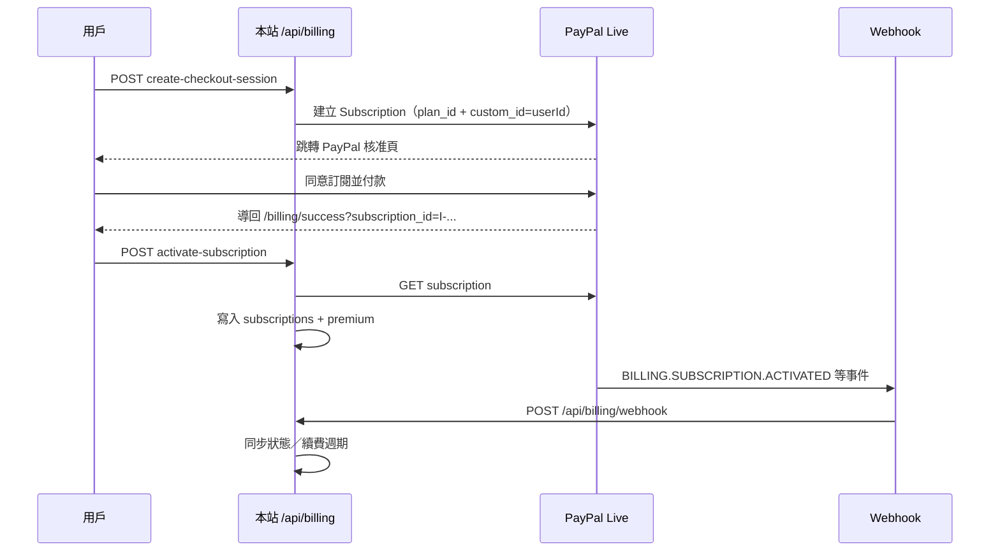

# PayPal 正式環境設定（Moonlight Passport）

本專案用 **PayPal Subscriptions API** 處理 **Moonlight Passport** 月費訂閱（HKD 58／月）。  
程式入口：`/premium` → `POST /api/billing/create-checkout-session` → PayPal 核准頁 → `/billing/success` → `POST /api/billing/activate-subscription`，並由 **`POST /api/billing/webhook`** 同步續費／取消狀態。

> 本文以 **Live（正式）** 為主。不建議在正式站使用 Sandbox；本地開發若暫時不接 PayPal，可留空 `PAYPAL_*`，網站仍支援 PayMe／FPS 人手付款。

---

## 你需要準備

| 項目 | 說明 |
|------|------|
| PayPal **商業帳戶** | 個人帳戶無法收訂閱；需完成商業驗證、可收 **HKD** |
| 已部署的網站 | 例如 `https://www.blackcatunderthemoon.com`（HTTPS 必填） |
| Vercel（或同等主機）環境變數權限 | 可設定 `PAYPAL_*` 且勿提交 git |
| Supabase | `subscriptions` 表與 `profiles.subscription_tier` 已存在（見 migrations） |

---

## 流程概覽



---

## 步驟 1：建立 Live App 並取得 API 憑證

1. 登入 [PayPal Developer Dashboard](https://developer.paypal.com/dashboard/)。
2. 右上角切換為 **Live**（不是 Sandbox）。
3. 左側 **Apps & Credentials** → **Create App**。
4. 命名例如 `Black Cat Moonlight Passport`，選 **Merchant** 類型。
5. 建立後複製：
   - **Client ID** → `PAYPAL_CLIENT_ID`
   - **Secret** → `PAYPAL_CLIENT_SECRET`（只顯示一次，請立即存到密碼管理器）

> **Secret 切勿**寫進 git、README 或前端程式。僅放在 Vercel／主機環境變數。

---

## 步驟 2：建立月費訂閱方案（Plan）

網站只存 **`PAYPAL_PLAN_ID`**，價格與幣別在 PayPal 端設定。請與 `/premium` 顯示一致：**HKD 58／月**。

### 方法 A — PayPal 商業後台（較直覺）

1. 登入 [PayPal 商業帳戶](https://www.paypal.com/businessmanage/account/home)。
2. 前往 **工具** → **所有工具** → **訂閱**／**定期付款**（介面可能顯示 *Subscription plans*）。
3. **建立方案**：
   - 名稱：`Moonlight Passport`（或 `Black Cat Under The Moon — Moonlight Passport`）
   - 價格：**58 HKD**
   - 週期：**每月**
   - 類型：**無固定期數**（持續訂閱，用戶可自行取消）
4. 建立完成後，在方案詳情或 Developer Dashboard 找到 **Plan ID**（通常以 `P-` 開頭）→ `PAYPAL_PLAN_ID`。

### 方法 B — REST API（與 Live App 同一組憑證）

若後台找不到 Plan ID，可用 Live token 建立 Product + Plan：

```bash
# 1) 取得 Live access token（將 CLIENT_ID / SECRET 換成你的 Live 憑證）
curl -s -X POST https://api-m.paypal.com/v1/oauth2/token \
  -u "YOUR_LIVE_CLIENT_ID:YOUR_LIVE_CLIENT_SECRET" \
  -H "Content-Type: application/x-www-form-urlencoded" \
  -d "grant_type=client_credentials"

# 2) 建立 Product（將 ACCESS_TOKEN 換成上一步的 token）
curl -s -X POST https://api-m.paypal.com/v1/catalogs/products \
  -H "Authorization: Bearer ACCESS_TOKEN" \
  -H "Content-Type: application/json" \
  -d '{
    "name": "Moonlight Passport",
    "description": "Black Cat Under The Moon premium membership",
    "type": "SERVICE",
    "category": "SOFTWARE"
  }'

# 3) 建立月費 Plan（PRODUCT_ID 換成上一步回傳的 id）
curl -s -X POST https://api-m.paypal.com/v1/billing/plans \
  -H "Authorization: Bearer ACCESS_TOKEN" \
  -H "Content-Type: application/json" \
  -d '{
    "product_id": "PRODUCT_ID",
    "name": "Moonlight Passport Monthly HKD 58",
    "billing_cycles": [{
      "frequency": { "interval_unit": "MONTH", "interval_count": 1 },
      "tenure_type": "REGULAR",
      "sequence": 1,
      "total_cycles": 0,
      "pricing_scheme": {
        "fixed_price": { "value": "58", "currency_code": "HKD" }
      }
    }],
    "payment_preferences": {
      "auto_bill_outstanding": true,
      "setup_fee_failure_action": "CONTINUE",
      "payment_failure_threshold": 3
    }
  }'
```

回應 JSON 的 `id` 即 `PAYPAL_PLAN_ID`。若 Plan 狀態為 `CREATED`，需再呼叫 **activate plan** API 才可在結帳使用（PayPal 文件：`POST /v1/billing/plans/{id}/activate`）。

---

## 步驟 3：設定 Webhook（正式站必填）

Webhook 負責：首次啟用、每月續費、取消、暫停、過期。  
**未設定 `PAYPAL_WEBHOOK_ID` 時**，程式會跳過簽名驗證（僅限開發）；**正式站務必設定**。

1. Developer Dashboard → **Live** → 你的 App → **Webhooks** → **Add Webhook**。
2. **Webhook URL**（換成你的正式網域）：

   ```
   https://www.blackcatunderthemoon.com/api/billing/webhook
   ```

3. 訂閱以下事件（與 `src/pages/api/billing/webhook.js` 一致）：

   | Event | 用途 |
   |-------|------|
   | `BILLING.SUBSCRIPTION.ACTIVATED` | 首次付款成功 → 開通 premium |
   | `BILLING.SUBSCRIPTION.UPDATED` | 週期／狀態更新 |
   | `PAYMENT.SALE.COMPLETED` | 每月扣款成功 → 更新週期 |
   | `BILLING.SUBSCRIPTION.CANCELLED` | 用戶取消（本期結束後降級） |
   | `BILLING.SUBSCRIPTION.SUSPENDED` | 扣款失敗 → `past_due` |
   | `BILLING.SUBSCRIPTION.EXPIRED` | 訂閱結束 |

4. 儲存後複製 **Webhook ID** → `PAYPAL_WEBHOOK_ID`。

### 本地測試 Webhook（選填）

正式收款前若要在本機驗 webhook，可用 [ngrok](https://ngrok.com/) 暴露：

```bash
ngrok http 3000
# 在 PayPal Live Webhook 暫時填：https://xxxx.ngrok-free.app/api/billing/webhook
```

測完改回正式網域。**不要用 Sandbox webhook 配 Live 憑證**（或反之）。

---

## 步驟 4：寫入環境變數

在 **Vercel → Project → Settings → Environment Variables**（Production）設定：

```env
PAYPAL_CLIENT_ID=你的_Live_Client_ID
PAYPAL_CLIENT_SECRET=你的_Live_Secret
PAYPAL_PLAN_ID=P-xxxxxxxx
PAYPAL_WEBHOOK_ID=xxxxxxxx
PAYPAL_MODE=live
NEXT_PUBLIC_SITE_URL=https://www.blackcatunderthemoon.com
```

| 變數 | 必填 | 說明 |
|------|------|------|
| `PAYPAL_CLIENT_ID` | ✓ | Live App Client ID |
| `PAYPAL_CLIENT_SECRET` | ✓ | Live App Secret |
| `PAYPAL_PLAN_ID` | ✓ | 月費方案 ID（`P-...`） |
| `PAYPAL_WEBHOOK_ID` | 正式站 ✓ | Webhook 簽名驗證用 |
| `PAYPAL_MODE` | ✓ | **必須為 `live`**（預設 `sandbox` 會連錯 API） |
| `PAYPAL_MANAGE_URL` | 選填 | 預設 `https://www.paypal.com/myaccount/autopay/` |
| `NEXT_PUBLIC_SITE_URL` | 建議 | PayPal 回傳 URL 的 fallback 網域 |

`.env.local` 範例見專案根目錄 `.env.example`。

設定後 **重新 Deploy**（Vercel 不會自動重載 env）。

---

## 步驟 5：驗證上線

1. 登入本站測試帳號 → 開啟 `/premium`。
2. 按 **立即升級 Moonlight Passport**：
   - 不應再出現「PayPal 尚未設定」。
   - 應跳轉 **paypal.com**（不是 sandbox.paypal.com）。
3. 用 **真實 PayPal 帳戶** 完成訂閱（會真的扣 HKD 58）。
4. 回到 `/billing/success` 後，帳戶應顯示 Moonlight Passport；`/account` 可 **管理訂閱／取消續費**（開啟 PayPal 自動付款頁）。
5. 在 PayPal Developer → Webhooks → 你的 endpoint → **Recent deliveries**，確認 `200` 且非 signature invalid。

### 資料庫應出現

- `subscriptions`：`provider=paypal`，`provider_subscription_id` 為 `I-...`，`status=active`
- `profiles.subscription_tier`：`premium`

---

## 用戶取消／退款

| 動作 | 行為 |
|------|------|
| 用戶在 PayPal 取消自動付款 | Webhook `CANCELLED` → 本期結束前仍為 premium，到期後降 free |
| 扣款失敗 | `SUSPENDED` → `past_due`，仍保留 premium 直至 PayPal 狀態更新 |
| 退款政策 | 見站內 [退款與取消政策](/refund.html)；虛擬內容恕不退款文案已於 `/premium` 顯示 |

人手 PayMe／FPS 開通不受 PayPal 影響，由管理員在 Dashboard 核對（`provider=manual`）。

---

## 疑難排解

| 現象 | 可能原因 | 處理 |
|------|----------|------|
| 「PayPal 尚未設定」 | 缺 `PAYPAL_CLIENT_ID`／`SECRET`／`PLAN_ID` | 補齊三項並 redeploy |
| 跳轉 sandbox.paypal.com | `PAYPAL_MODE=sandbox` 或用了 Sandbox 憑證 | 改 `live` + Live 憑證 |
| 核准後仍是 free | Webhook 未送達或簽名失敗 | 檢查 `PAYPAL_WEBHOOK_ID`、URL 是否 HTTPS、Vercel 函式 log |
| `Webhook signature invalid` | Webhook ID 錯、或 Live/Sandbox 混用 | 用 **同一 Live App** 下的 Webhook ID |
| `paypal_checkout_failed` | Plan 未 activate、幣別不支援、商業帳戶未驗證 | 查 Vercel log 內 `err.details`；確認 HKD 方案已啟用 |
| 管理訂閱開錯頁 | 自訂 `PAYPAL_MANAGE_URL` | 預設已指向 PayPal 自動付款管理 |

相關程式：

- `src/lib/paypal.js` — API、同步 DB、Webhook 驗簽
- `src/pages/api/billing/create-checkout-session.js`
- `src/pages/api/billing/activate-subscription.js`
- `src/pages/api/billing/webhook.js`
- `src/pages/api/billing/create-portal-session.js`

---

## 安全 checklist

- [ ] Live Secret 只存在 Vercel／密碼管理器
- [ ] `PAYPAL_MODE=live` 僅在 Production 環境
- [ ] 正式站已設定 `PAYPAL_WEBHOOK_ID`
- [ ] Webhook URL 使用正式 HTTPS 網域
- [ ] Plan 價格 HKD 58 與 `/premium`、TOS、退款頁一致

完成以上步驟後，Moonlight Passport 即可以 **正式 PayPal 訂閱** 收款，無需 Sandbox。
